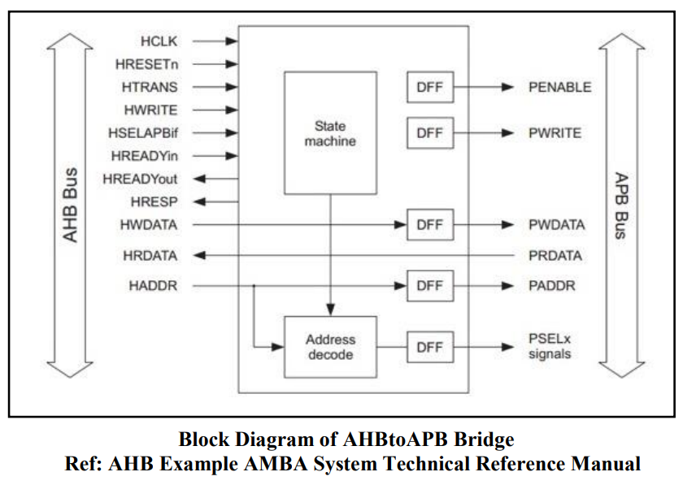
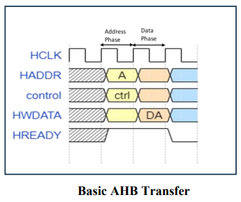
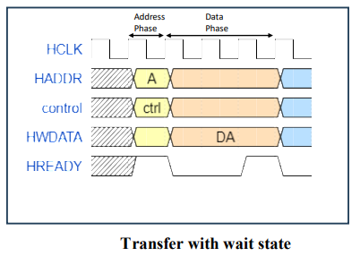
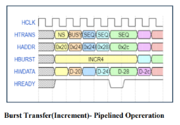
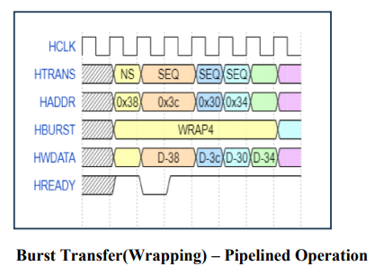

# AHB2APB_Bridge_Verification
## SPECIFICATIONS:
- Hburst generated by AHB, which supports **single**, **incrementing**, and **burst transfers**, should be converted into **single APB transfers**.  
- The bridge should be able to transfer all possible **Hsize** values (**1, 2, 4 bytes**) to the APB side.  
- The bridge should transfer **both write and read operations** for all Hburst transfers.
## SIGNALS LIST:  
- HCLK - This clock times all bus transfers. All signal timings are related to the rising edge of HCLK.
- HRESETn - The bus reset signal is active LOW and is used to reset the system and the bus. This is the only active LOW signal.
- HADDR[31:0] - The 32-bit system address bus.
- HTRANS[1:0] - Indicates the type of the current transfer, which can be NONSEQUENTIAL,SEQUENTIAL, IDLE or BUSY.  
- HWRITE - When HIGH this signal indicates a write transfer and when LOW a read transfer.  
- HSIZE[2:0] - Indicates the size of the transfer, which is typically byte (8-bit), halfword (16-bit) or word (32-bit). The protocol allows for larger transfer sizes up to a maximum of 1024 its.  
- HBURST[2:0] - Indicates if the transfer forms part of a burst. Four, eight, and sixteen beat bursts are supported and the burst may be either incrementing or wrapping.
- HWDATA[31:0] - The write data bus is used to transfer data from the master to the bus slaves during write operations. A minimum data bus width of 32 bits is recommended. However, this may easily be extended to allow for higher bandwidth operation.
- HRDATA[31:0] - The read data bus is used to transfer data from bus slaves to the bus master during read operations. A minimum data bus width of 32 bits is recommended. However, this may easily be extended to allow for higher bandwidth operation.
- HREADY - When HIGH the HREADY signal indicates that a transfer has finished on the bus. This signal may be driven LOW to extend a transfer. Note: Slaves on the bus require HREADY as both an input and an output signal.
- HRESP[1:0] - The transfer response provides additional information on the status of a transfer. Four different responses are provided, OKAY, ERROR, RETRY and SPLIT.
- PENABLE - This strobe signal is used to time all accesses on the peripheral bus. The enable signal is used to indicate the second cycle of an APB transfer. The rising edge of PENABLE occurs in the middle of the APB transfer.
- PADDR[31:0] - This is the APB address bus, which may be up to 32-bits wide and is driven by the peripheral bus bridge unit.
- PWRITE - When HIGH this signal indicates an APB write access and when LOW a read access.
- PRDATA - The read data bus is driven by the selected slave during read cycles (when PWRITE is LOW). The read data bus can be up to 32-bits wide.
- PWDATA - The write data bus is driven by the peripheral bus bridge unit during write cycles (when PWRITE is HIGH). The write data bus can be up to 32-bits wide.
- PSELx - A signal from the secondary decoder, within the peripheral bus bridge unit, to each peripheral bus slave x. This signal indicates that the slave device is selected and a data transfer is required. There is a PSELx signal for each bus slave.
## BLOCK DIAGRAM:
Here is the block diagram of the **AHB2APB BRIDGE**:

## AHB PROTOCOL (WAVEFORMS):

## APB PROTOCOL (WAVEFORMS):

